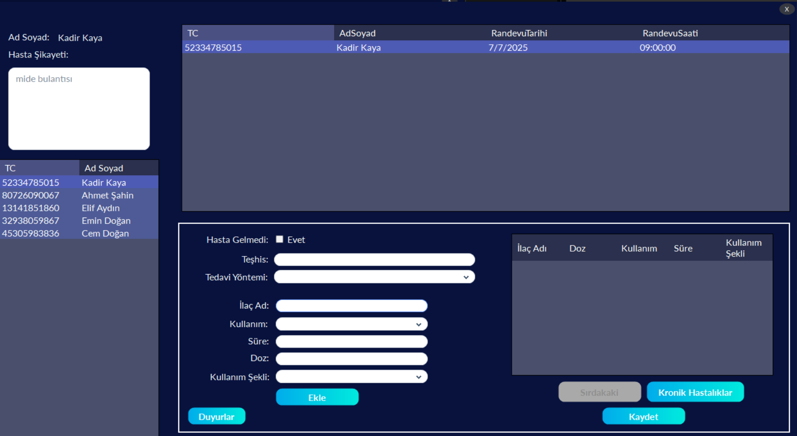
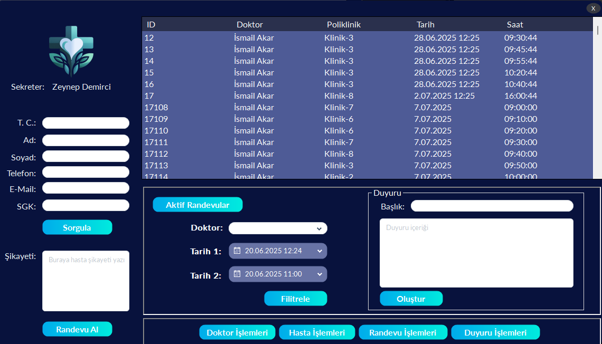
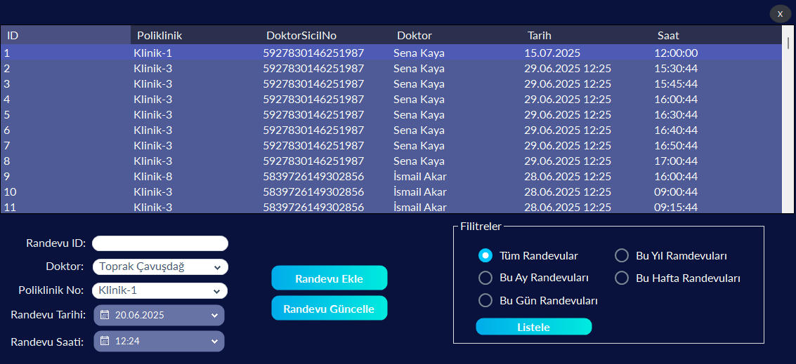
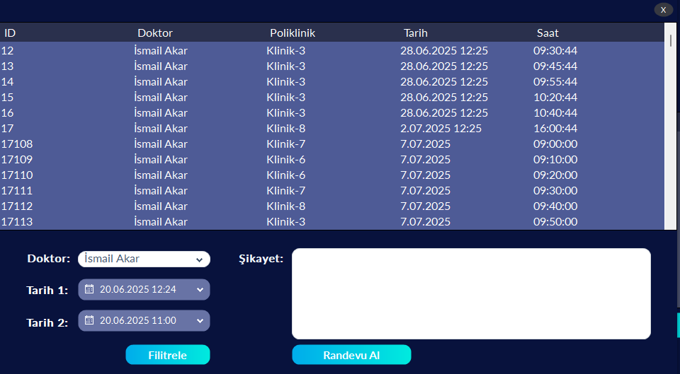

# Stok Takip Programı

Healora – Akıllı Hastane Otomasyon Sistemi

Healora, kişisel gelişim amacıyla prototip olarak geliştirilmiş, modüler yapıya sahip bir hastane otomasyon sistemidir. Doktor, sekreter ve hasta olmak üzere üç ana kullanıcı rolünü destekleyen bu sistem, sağlık süreçlerini dijital ortamda daha düzenli ve erişilebilir hale getirmeyi hedefler.

- Hastalar, sistem üzerinden kolayca randevu alabilir, geçmiş ve gelecek randevularını görüntüleyebilir, kronik - hastalık bilgilerine ulaşabilir ve istedikleri doktordan randevu talebinde bulunabilirler.

- Sekreterler, doktor ve hasta işlemlerini kolaylıkla yönetebilir; randevuları düzenleyebilir, doktor bilgilerini güncelleyebilir, hastalar adına randevu oluşturabilir ve genel duyurular paylaşabilir.

- Doktorlar ise günlük randevu listesini saat bazlı olarak görüntüleyebilir, hastaları sırasıyla kabul edebilir ve tedavi süreci için gerekli ilaç ve teşhis bilgilerini detaylı olarak kaydedebilir.

Programın çalışır halde bulunan video: {https://youtu.be/I1IvXdikRns}
 
# Proje Veritabanının Kurulumu ve Yapılandırılması

Uygulamanın veritabanını kendi SQL Server Management Studio ortamınıza eklemek için aşağıdaki adımları takip ediniz:

1. SQL Server Management Studio'yu açınız.  
2. Sol kısımdaki Databases bölümüne sağ tıklayarak Restore Database seçeneğine tıklayınız. 
3. Açılan panelde Device radio butonuna tıklayıp yanındaki 3 noktaya tıklayınız. 
4. Açılan panelde "Add" butonuna basınız. 
5. Açılan dosya gezgininde "DbHealoraMedical.bak" dosyasını nereye koyduysanız onu bulup seçiniz. 
6. Seçtikten sonra açık olan tüm panelerde okay, okay diyerek database kurunuz.  
6. Ardından Visual Studio ortamında App.config dosyasını açınız.  
7. ConnectionStrings etkiketinin içerisindeki datasource kısmına kendi local data base isminizi yazınız.  

Belirtilen adımları eksiksiz uyguladığınız takdirde proje sorunsuz bir şekilde çalışacaktır.

## Giriş Ekranı Sayfası

## Doktor Giriş Sayfası

## Doktor İşlem Sayfaı

## Kronik Hastalıkları Görme Sayfası

## Sekreter Giriş Sayfası

## Sekreter İşlem Sayfaı

## Aktif Randevuları Görme Sayfası

## Doktor Ekleme/Silme/Güncelleme Sayfası

## Hasta Ekleme/Silme/Güncelleme Sayfası

## Randevu Ekleme/Silme/Güncelleme Sayfası

## Duyuru Ekleme Sayfası

## Hasta Giriş Sayfası

## Hasta İşlem Sayfaı

## Hasta Randevu Alma Sayfaı

